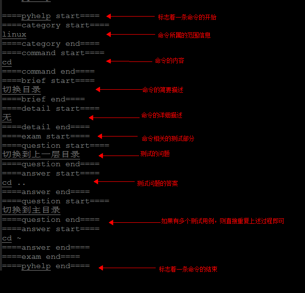
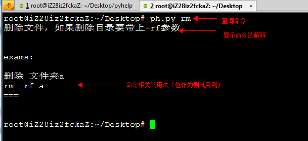
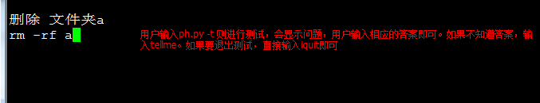

#   ph.py 帮您解决命令的反复记忆问题
ph.py是一款帮助您记住日常命令的工具。我们经常会反复的查找资料看一个命令如何使用，ph.py就是帮助您解决这方面的困扰. 
##  说明：
①：第一次使用该软件，请将pyhelp文件夹中的ph.py文件和ph_config.ini文件拷贝到/usr/bin/目录下，并设置文件权限为755 
②: 将ph_config.ini文件中的路径内容改为当前pyhelp文件夹所在的路径 
③:下面示例中的中括号中的内容表示是任选的。 
④：pyhelp记录的每个命令有如下相关信息： 
    1：category：该命令所属的范围，比如linux命令，或者是git命令等。 
    2：command: 命令名称。 
    3：brief：命令的简要说明（在默认情况下,查询命令只显示命令的简要说明信息）。 
    4：detail：命令的详细说明。 
    5: exam: 考查测试。 
##  用法：
1:插入命令：在终端输入ph.py -i [需要记录的命令的数量]。 
然后系统会打开相应的编辑文件，您只要在文件中填入相关的信息即可。-i是insert的缩写。 

2:刷新文件：在终端输入ph.py -c。该命令会检查pyhelp文件夹下的所有文件， 
并将其数据导入数据库中，并删除文件。-c 是clean的缩写。如果想导入文件只要将文件放置于pyhelp文件夹下，而且支持.txt和.json两种格式 

3:编辑命令: 在终端输入ph.py -e filename [-category category_name]。 
该命令将重新编辑记录的命令。-e 是edit的缩写, -category 表示只编辑category_name相关的命令。 

4:删除命令: 在终端输入ph.py -d filename [-category category_name]。 
该命令将删除制定的文件。-d是delete的缩写。 

5:导出到文件: 在终端输入ph.py -o [filename]。该命令会将数据库中的数据导出到文件中。 
注意：如果加上filename，则会导出到指定文件中，否则导出到随机生成的文件中.-o是output的缩写。 

6:查看命令: 在终端输入ph.py command [-category category_name] [-detail]。该命令会显示相关命令的信息 
添加-category category_name 限定命令的范围，主要用于避免命令重名现象。 
添加-detail参数表示是否详细显示命令。 

7:测试命令: 在终端输入ph.py -t category。该命令会显示category下的所有命令的测试内容，用户根据提示信息，输入相应的命令，直到输入全部的命令为止。 

8：寻求帮助: 在终端中输入ph.py -h，会显示详细的帮助信息, -h 是help的缩写。 

###命令文件的格式说明
关于输入文件的格式说明： 
输入文件中每一条命令的格式如下： 

    ====pyhelp start==== 

    ====category start==== 
        这里面是Category相关内容 
    ====category end==== 

    ====command start==== 
        这里是command相关的内容 
    ====command end==== 

    ====brief start==== 
        这里是命令的简要描述 
    ====brief end==== 

    ====detail start==== 
        这里是命令的详细信息 
    ====detail end==== 
    
    ====exam start==== 
        这里是测试相关部分 
    ====question start==== 
        测试问题开始 
    ====question end==== 

    ====answer start==== 
        测试问题相关的答案 
    ====answer end==== 

    ====exam end==== 

    ====pyhelp end==== 
    
###  说明：
pyhelp start与pyhelp end：标志命令的开始与结束 
category start与category end：标志category范围，用户只要在该标志内写入category信息即可。 
exam start和exam end：标志测试的范围。 
用户需要在下面的equestion start和equestion end中写入问题， 
并在answer start与answer end中写入答案。 
如果有多个测试单元，则重复多次即可 

###示例：
 
 
 
 
 

